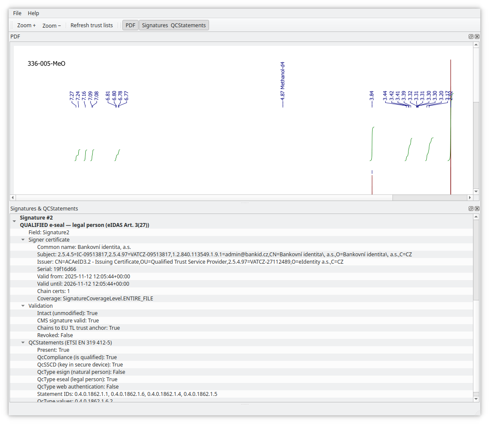

# PDF signature validator for PDFs with EU's qualified signatures

## Overview

This program takes main argument, a PDF file.

Checks all signatures extracted from PDF against whether they are valid, whether
they chain to the qualified CAs obtained from EU LOTL and national TLs.

Checks `QcStatements` so that we know the signer certificate is qualified (person, seal...).

Outputs signatures - CN of signer - and result for each signature:

  * signature is consistent, not broken due to bad data
  * signature chains to a known root
  * such CA root belongs among the EU qualified signature roots (person, seal, web is recognized now)
  * shows other OIDs found under the QcStatements extension

## Disclaimer:

I've read the specs, but this is still experimental. Partly done with LLM even though I
reviewed and debugged living sh_t out of it inbetween various commits, fixed
some mistakes it made in parsing ASN.1 structs...

Bugs can happen, pretty sure there are some things that should be more verbose etc.

## Install:

Python >= 3.10 is required.

Install venv and add `requirements.txt` according to file.

Note that you can switch PyQt5 and PyQt6 in the requirements (not sure if both can be
installed at once).

    python3 -m venv .venv
    source .venv/bin/activate
    pip install -r requirements.txt

## Example run (in the virtualenv), in `src` dir:

    python3 ./check_eu_signatures.py --hard-revocation MySigned.pdf
    python3 ./check_eu_signatures.py --refresh-cache MySigned.pdf
    python3 ./viewer_qt5.py [...args...] [MySigned.pdf]
    python3 ./viewer_qt6.py [...args...] [MySigned.pdf]

GUI versions allow file to be specified on command line, via `File->Open` or drag&drop.

## File cache for EU LOTL XML and TL XML that contain certificates

Default location is XDG cache, but can be specified to be
elsewhere with `--cache` parameter. Cache is refreshed when either 24 hours pass
or LOTL `NextUpdate` is reached or file is missing.

Use `--refresh-cache` for full download of all certificates again.

## Test PDF sources

Didn't find yet ones with signature that chains to EU TL, only private ones I made.

Though here's a repo which will at least allow you to see signature check:

https://github.com/esig/dss/tree/master/dss-pades/src/test/resources

## Build into AppImage

Goto `appimage/` directory. Then run:

    bash build.sh

AppImage with compatibility layer of Ubuntu 20.04 LTS should appear (so PyQt5)

## Main window layout and dock saving between runs

Application stores state in XDG cache, usually located in `~/.cache/sigviewer`.

This is a shortcut so that people can set the layout and have it permanent as
they like. If you want to reset it for some reason, use `--reset-layout` command
line paramater.

## Translation

There is one basic translation, for cs_CZ, which can be either triggered by `$LANG` setting
or manually by `--lang=cs` on the command line. Debug and expert expressions are still in
English (since they are not translatable), but things like main signature verdict and menus
are translated.